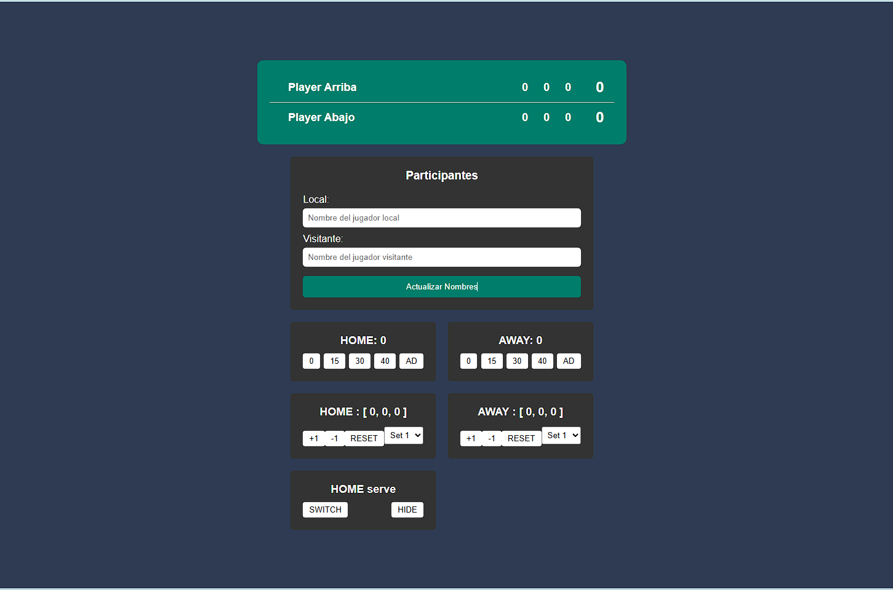

# scoreboard

## Descripción

Este proyecto es un marcador de tenis interactivo que permite a los usuarios llevar la cuenta de los puntos y sets de un partido de tenis. La interfaz incluye controles para actualizar los nombres de los jugadores, ajustar los puntajes de juego y sets, y alternar el servidor.

## Funcionalidades

- **Actualizar Nombres de Jugadores**: Permite ingresar y actualizar los nombres de los jugadores locales y visitantes.
- **Control de Puntajes de Juego**: Botones para actualizar los puntajes de juego (0, 15, 30, 40, AD).
- **Control de Sets**: Botones para incrementar, decrementar y resetear los puntajes de sets.
- **Alternar Servidor**: Botón para alternar el servidor entre los jugadores.
- **Ocultar Íconos de Servicio**: Botón para ocultar los íconos de servicio.

## Uso

1. **Actualizar Nombres**:
   - Ingrese los nombres de los jugadores en los campos de texto correspondientes.
   - Haga clic en el botón "Actualizar Nombres" para aplicar los cambios.

2. **Actualizar Puntajes de Juego**:
   - Haga clic en los botones de puntaje (0, 15, 30, 40, AD) para actualizar el puntaje del juego actual.

3. **Controlar Sets**:
   - Seleccione el set que desea ajustar en el menú desplegable.
   - Use los botones `+1`, `-1` y `RESET` para ajustar el puntaje del set seleccionado.

4. **Alternar Servidor**:
   - Haga clic en el botón "SWITCH" para alternar el servidor entre los jugadores.

5. **Ocultar Íconos de Servicio**:
   - Haga clic en el botón "HIDE" para ocultar los íconos de servicio.

## Estructura del Proyecto
